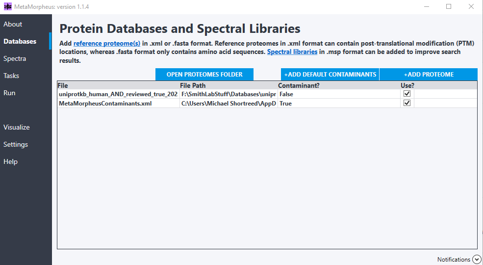
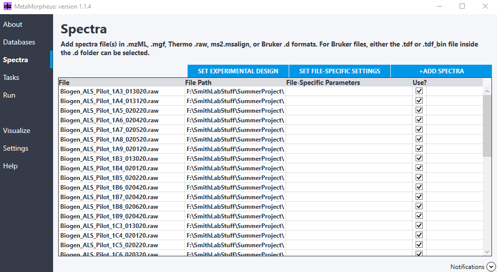
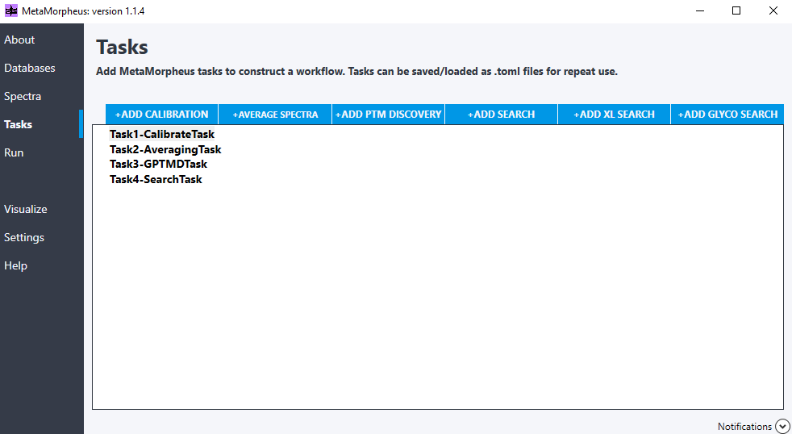
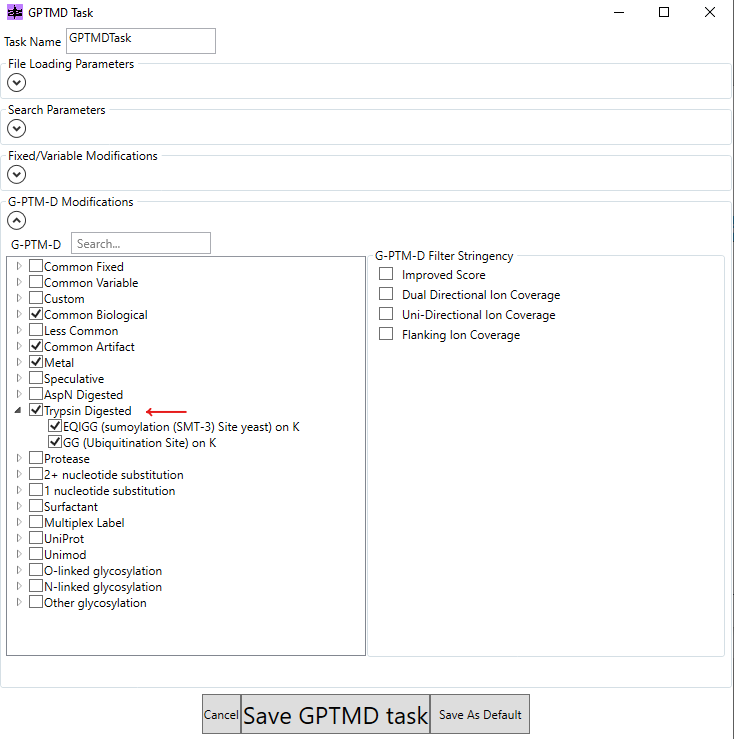
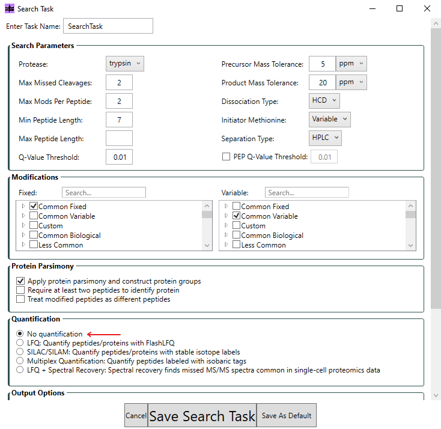
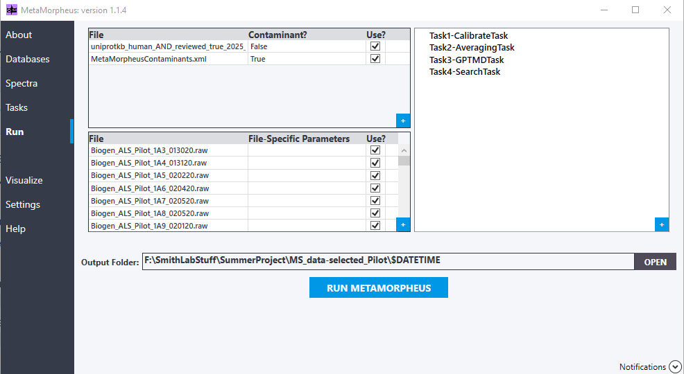

[MetaMorpheus](https://github.com/smith-chem-wisc/MetaMorpheus) performs peptide and protein
identification and, critically for this work, **PTM discovery** via GPTMD (Global Post-Translational
Modification Discovery). Two parallel searches are run — one with a diverse PTM panel and one with a
limited panel — so that the downstream analysis can compare them.

## Installation

Download MetaMorpheus from the [release page](https://github.com/smith-chem-wisc/MetaMorpheus#readme).

## Inputs and outputs

- **Input:** `.raw` spectra files and a protein database (`.fasta` or `.xml`).
- **Output:** `AllPeptides.psmtsv`, `AllProteinGroups.psmtsv`, `AllPSMs.psmtsv`.

## Walkthrough

### Databases

Drag and drop a `.fasta` or `.xml` database and click **+ADD DEFAULT CONTAMINANTS**.

- Databases for the target species can be downloaded from [UniProt](https://www.uniprot.org/).
- The `.xml` format extends the `.fasta` file with annotated PTMs collected from the literature —
  this is what enables the **diverse** search. The **limited** search uses the plain `.fasta`.

### Spectra

Drag and drop the `.raw` spectra files.

### Tasks

- **Task 1** — **+ADD CALIBRATION** (defaults)
- **Task 2** — **+AVERAGE SPECTRA** (defaults)
- **Task 3** — **+ADD PTM DISCOVERY** (GPTMD) with defaults plus selection of trypsin-digested
  modifications. This is where the diverse PTM panel is defined.

  

- **Task 4** — **+ADD SEARCH** with quantification turned **off** (quantification is performed
  separately in FlashLFQ).

  

### Run

Click **RUN METAMORPHEUS**, changing the output folder if desired.

::: {.callout-tip}
Run the search **twice** — once with the diverse `.xml` database and GPTMD panel, and once with the
limited `.fasta` and restricted modifications — keeping the outputs in separate folders
(`DiversePtms/` and `LimitedPtms/`). The downstream analysis expects both.
:::

Next: [Quantification with FlashLFQ + PIP-ECHO →](02-flashlfq.qmd)
