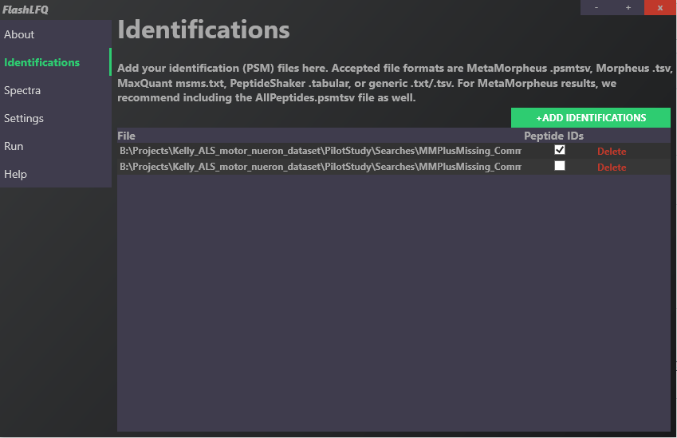
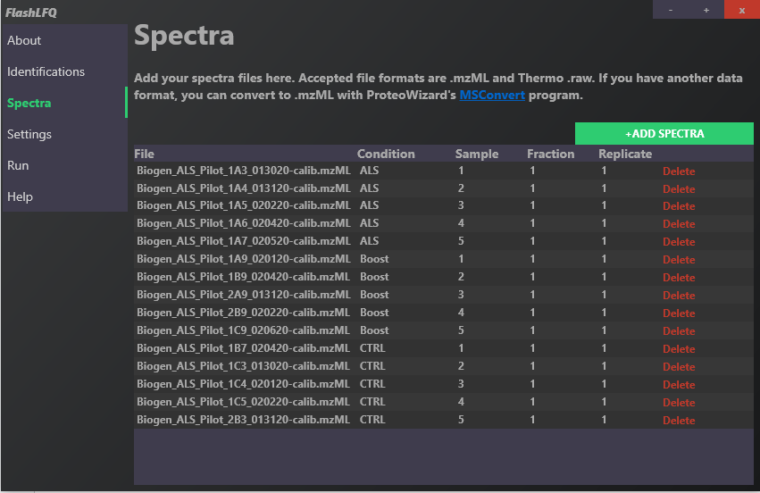
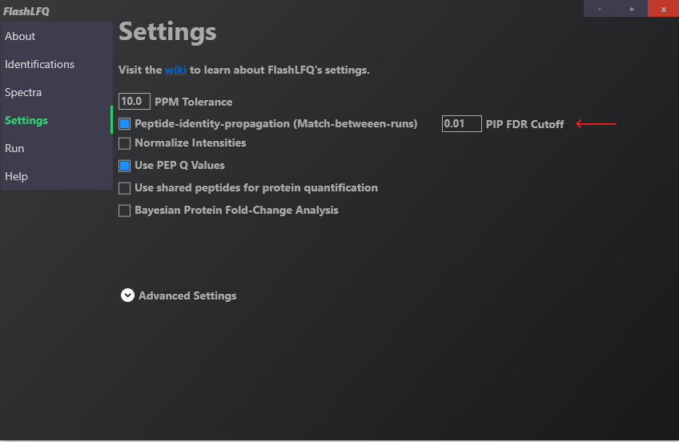
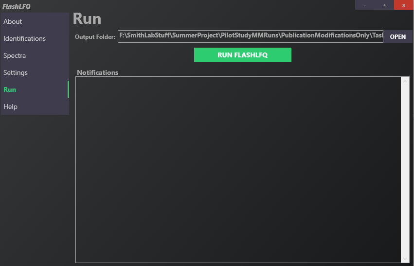

[FlashLFQ](https://github.com/smith-chem-wisc/FlashLFQ) performs label-free quantification. Its
**PIP-ECHO** mode (Peptide-Identity-Propagation with Empirically-Calibrated, FDR-controlled
match-between-runs) recovers quantities for peptides that were identified in some cells but not
others — essential for the sparse, missing-value-heavy single-cell setting.

## Installation

Download FlashLFQ from the [release page](https://github.com/smith-chem-wisc/FlashLFQ).

## Inputs and outputs

- **Input:** `AllPeptides.psmtsv`, `AllPSMs.psmtsv` (from MetaMorpheus) and `.mzML` spectra files.
- **Output:** `QuantifiedPeaks.tsv`, `QuantifiedPeptides.tsv`, `QuantifiedProteins.tsv`.

## Walkthrough

### Identifications

Drag and drop the `AllPeptides.psmtsv` and `AllPSMs.psmtsv` files produced by MetaMorpheus.

### Spectra

Drag and drop the `.mzML` spectra files from the MetaMorpheus calibration task.

Define an `ExperimentalDesign.tsv` in the same folder as the `.mzML` files, or edit the
`Condition`, `Sample`, `Fraction`, and `Replicate` fields directly in the GUI. After an initial
run, FlashLFQ writes an experimental-design file automatically that you can refine.

### Settings

Use the defaults, and enable **Peptide-identity-propagation (Match-between-runs)** with a
**0.01 PIP FDR** cutoff.

### Run

Click **RUN FLASHLFQ**, changing the output folder if desired.

::: {.callout-note}
The resulting `QuantifiedPeptides.tsv` (one per search strategy) is the direct input to the R
analysis in [step 4](04-r-analysis.qmd). These tables are included in the repository under
`Data/DiversePtms/` and `Data/LimitedPtms/`.
:::

> **Reference:** [*Improved detection of differentially abundant proteins through FDR-control of
> peptide-identity-propagation*](https://pubs.acs.org/doi/full/10.1021/acs.jproteome.5c00065)

Next: [Differential expression with limpa →](03-limpa.qmd)
