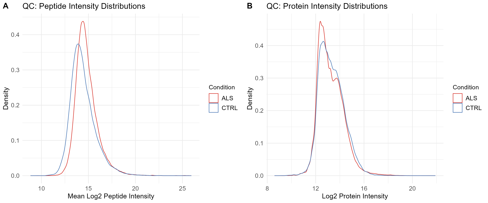
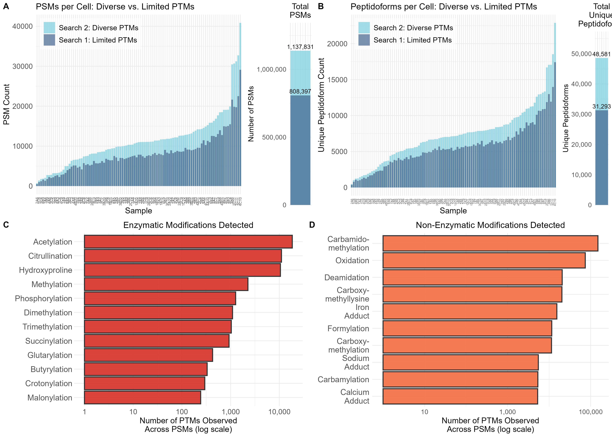
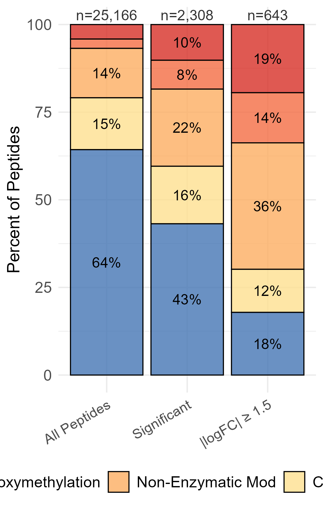
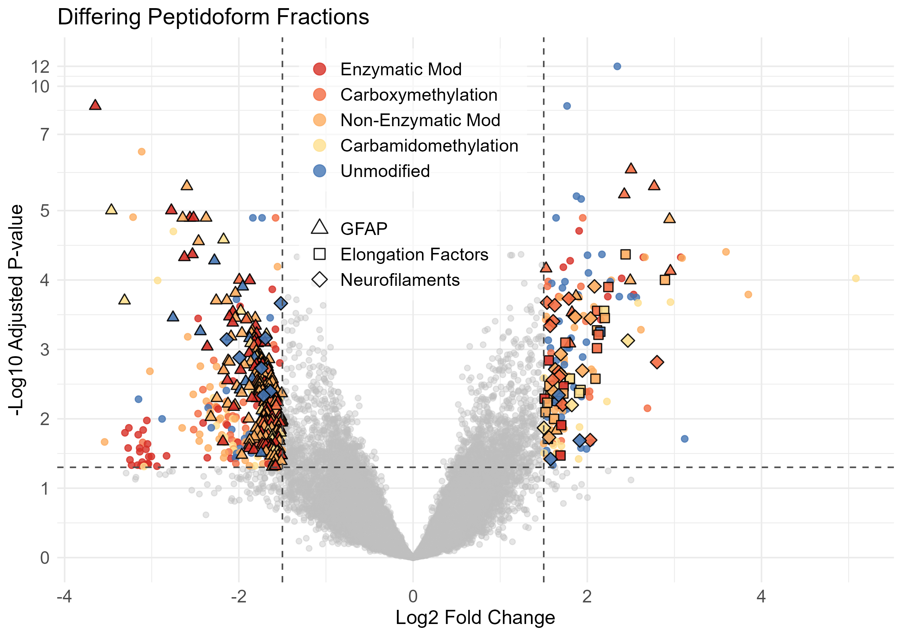
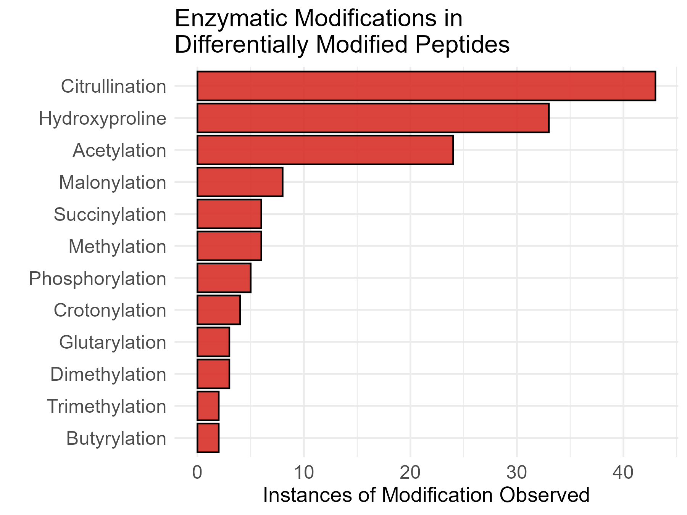
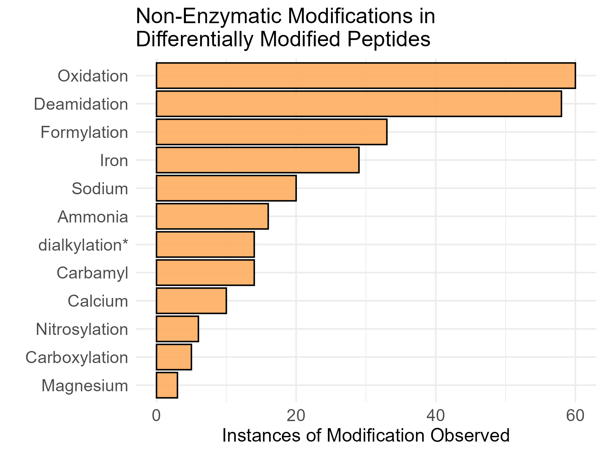
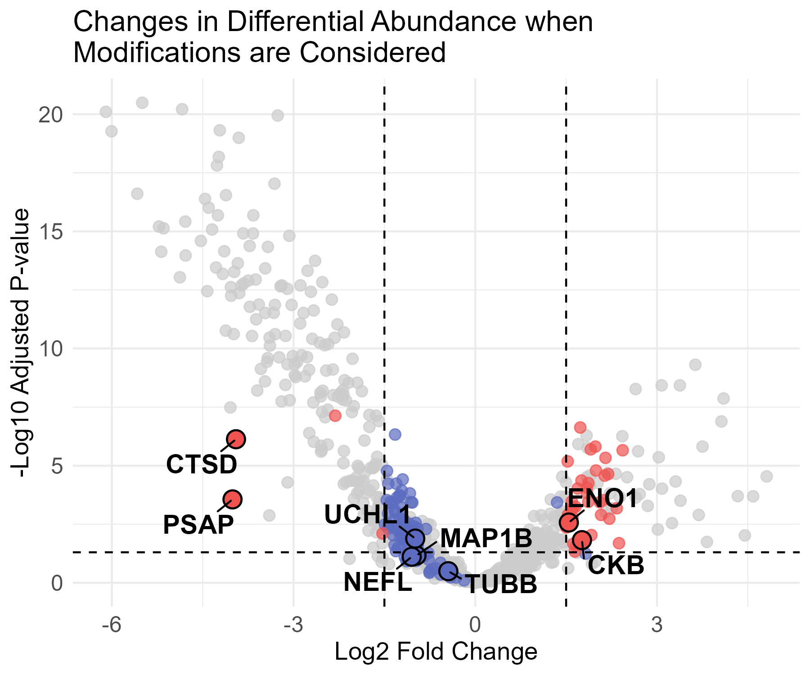
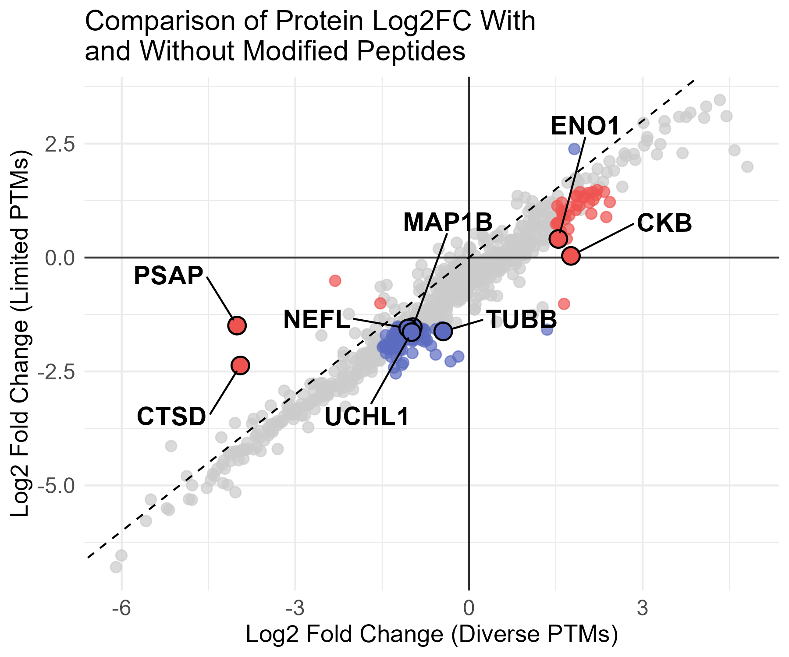
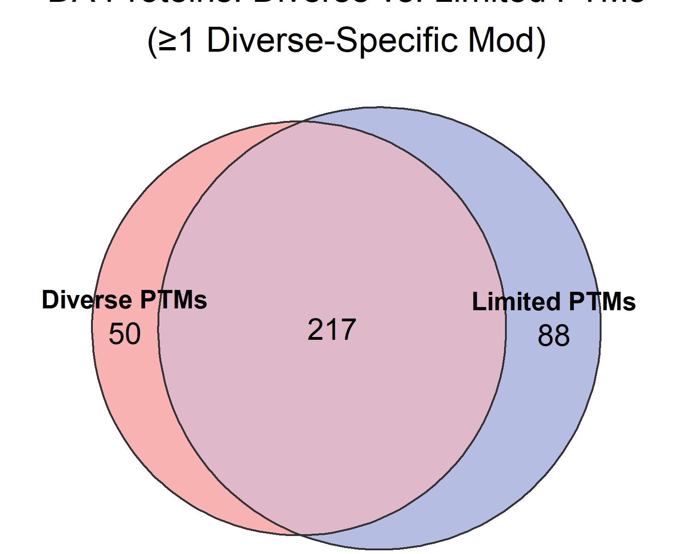

This page walks through the R analysis that turns the quantification tables into the manuscript's
results and figures. The full scripts are:

- `MainManuscript/CustomScripts.R` — data loading, cleaning, PTM parsing, and metadata helpers.
- `MainManuscript/analysis.R` — all differential-abundance and PTM analyses (run this first).
- `MainManuscript/plotting.R` — all publication figures (run after `analysis.R`).
- `Supplemental/analysis.R` + `Supplemental/plotting.R` — supplementary analyses and figures.

::: {.callout-important}
Set the working directory to the **repository root** before running (opening
`Quantification_of_PTMs.Rproj` in RStudio does this). All paths are relative to that root.
The code below is shown for reference and is not executed when this site builds; the figures are
the actual manuscript outputs.
:::

## Setup

```r
library(tidyverse)
library(limpa)
library(limma)
source("MainManuscript/CustomScripts.R")

# Thresholds used throughout
PROP_OBS_MIN_ANALYSIS <- 0.02   # peptide observability filter applied before model fitting
PROP_OBS_MIN_RESULTS  <- 0.12   # stricter filter for reported results (~observed in >= 10 cells)
logFC_cutoff <- 1.5
pval_cutoff  <- 0.05
```

The two FlashLFQ searches are loaded the same way; the diverse-PTM EList (`y.peptide`,
`y.protein`, `y.peptide.imputed`) and the limited-PTM EList (`y.peptide.lim`, `y.protein.lim`) are
built as shown on the [limpa page](03-limpa.qmd) and cached to `Data/`.

## Quality control

Before any filtering, per-sample log2 intensity distributions are checked for systematic shifts
between ALS and control cells, at both the peptide and protein level.

```r
pep_long <- as.data.frame(y.peptide$E) %>%
  rownames_to_column("PeptideSequence") %>%
  pivot_longer(-PeptideSequence, names_to = "Sample", values_to = "Log2Int") %>%
  filter(!is.na(Log2Int)) %>%
  left_join(y.peptide$targets[, c("Sample", "Group")], by = "Sample")

ggplot(pep_long, aes(x = Log2Int, color = Group)) +
  geom_density() +
  scale_color_manual(values = c("ALS" = "#d73027", "CTRL" = "#4575b4"))
```



## Figure 1 — PTM discovery: diverse vs limited searches

Figure 1 quantifies how much more is discovered by the diverse search. PSMs and peptidoforms are
filtered to a 1% peptide-level FDR, counted per cell for each search strategy, and the diverse
search's modifications are broken down into enzymatic vs non-enzymatic classes.

```r
filter_mm_results <- function(df, q_threshold = 1, pep_q_threshold = 0.01) {
  df %>% filter(PEP_QValue <= pep_q_threshold,
                QValue     <= q_threshold,
                !grepl("C|D", Decoy.Contaminant.Target))
}

diverse_psm <- read.csv(PATH_DIVERSE_PSM, sep = "\t") %>% filter_mm_results()
limited_psm <- read.csv(PATH_LIMITED_PSM, sep = "\t") %>% filter_mm_results()

# Per-cell counts, then a modification-type breakdown of the diverse search
mod_list <- GetModsTextWReplacement(diverse_psm$Full.Sequence, all_mods = TRUE)
```

::: {.callout-note}
This panel reads the raw `AllPSMs.psmtsv` / `AllPeptides.psmtsv` files, which are **not**
redistributed (they live on the lab network and are git-ignored). Copy your MetaMorpheus outputs
into `Data/DiversePtms/` and `Data/LimitedPtms/` to regenerate it.
:::



## Figure 2 — Peptidoform composition and the occupancy model

Every peptidoform is classified — unmodified, enzymatic, carboxymethylation, carbamidomethylation,
or other non-enzymatic — using `ClassifyPeptideModsSpecific()`. Figure 2 shows how that composition
shifts as the peptide set is restricted to significant and high-fold-change differential
peptidoforms.

The differential test itself works on **PTM occupancy**: each modified peptide is normalized to its
parent protein (propagating standard error), low-coverage peptides are filtered out, and `dpcDE()` /
`eBayes()` test for an ALS-vs-control difference, blocking on donor.

```r
design <- model.matrix(formula(~0 + Group), data = targets)
colnames(design) <- gsub("Group", "", colnames(design))

# Normalize each modified peptide to its parent protein (SE-propagating)
all.mod.normed.pro <- GetNormalizedEList(
  y.peptide.imputed$genes$PeptideSequence, y.peptide.imputed,
  y.protein = y.protein, normalize_to_protein = TRUE
)
all.mod.normed.pro <- all.mod.normed.pro[all.mod.normed.pro$genes$PropObs >= PROP_OBS_MIN_ANALYSIS, ]

fit_occ    <- dpcDE(all.mod.normed.pro, block = targets$Donor, design = design, plot = FALSE)
fit_occ2   <- contrasts.fit(fit_occ, makeContrasts(ALS_vs_CTRL = "ALS - CTRL", levels = design))
eb_fit_occ <- eBayes(fit_occ2)

table_occ <- topTable(eb_fit_occ, coef = "ALS_vs_CTRL", number = Inf)
table_occ$Category <- ClassifyPeptideModsSpecific(
  GetModsTextWReplacement(table_occ$PeptideSequence, all_mods = TRUE) %>% sapply(paste)
)
```



## Figure 3 — Differentially modified peptidoforms

Peptidoforms passing the occupancy test (`adj.P.Val <= 0.05`, `|logFC| >= 1.5`) are visualized in a
volcano plot colored by modification class, with neurofilaments, GFAP, and elongation factors
highlighted. The modifications driving these differential peptidoforms are then tallied.

```r
de_splice <- base_filtered %>%
  filter(adj.P.Val <= pval_cutoff, abs(logFC) >= logFC_cutoff, PropObs > PROP_OBS_MIN_RESULTS) %>%
  arrange(desc(abs(logFC)))
```



::: {layout-ncol=2}



:::

## Figure 4 — Protein-level differential abundance: diverse vs limited

Finally, protein-level differential abundance is run for **both** searches (proteins with ≥ 2
peptides; `dpcDE()` + `eBayes()`, blocked on donor) and the two result tables are merged. Genes are
labeled by whether their DA call is shared, diverse-only (`ModDA`), or limited-only (`NoModDA`), and
each gene's modified-peptide count is attached. This is where including modified peptidoforms
visibly changes which proteins are called differentially abundant.

```r
y.protein.filt <- y.protein[y.protein$genes$NPeptides >= 2, ]
fit_pro    <- dpcDE(y.protein.filt, design = design, block = targets$Donor,
                    plot = FALSE, sample.weights = TRUE)
fit_pro2   <- contrasts.fit(fit_pro, makeContrasts(ALS_vs_CTRL = "ALS - CTRL", levels = design))
table_protein_diverse <- topTable(eBayes(fit_pro2), coef = "ALS_vs_CTRL", number = Inf)

# ... the same for the limited search (table_protein_limited) ...

merged_pro <- merge(table_protein_diverse,
                    table_protein_limited[, c("Gene", "logFC", "adj.P.Val")],
                    by = "Gene", suffixes = c("", "_NoMod")) %>%
  mutate(LogFC_Diff = logFC - logFC_NoMod,
         ModDiff = case_when(
           Gene %in% setdiff(limited_de_genes, diverse_de_genes) ~ "NoModDA",
           Gene %in% setdiff(diverse_de_genes, limited_de_genes) ~ "ModDA",
           TRUE ~ "Shared"))
```

::: {layout-ncol=2}



:::



## Outputs

`analysis.R` writes the key result tables to `Data/`:

- `DE_proteins.tsv` — differentially abundant proteins (diverse search).
- `ModDiscordant_proteins.tsv` — proteins whose DA call differs between searches.
- `ModDiscordant_withCat_breakdown.tsv` — the same, with per-category modified-peptide counts.

`plotting.R` writes every figure to `MainManuscript/Figures/`. To regenerate everything from the
cached quantification tables:

```r
source("MainManuscript/analysis.R")   # builds all analysis objects (uses Data/ cache if present)
source("MainManuscript/plotting.R")   # writes figures to MainManuscript/Figures/
```
